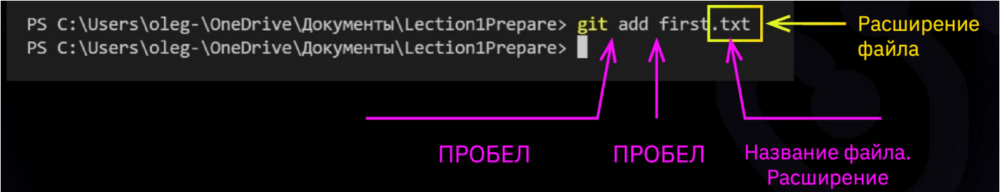

# Знакомство с Git

* ## git init

Инициализация: указываем папку, в которой
git начнёт отслеживать изменения.
В папке создаётся скрытая папка .git

* ##  git status

Показывает текущее состояние гита, есть 

ли изменения, которые нужно закоммитить
(сохранить). 

*Чтобы вызвать ранее введённую команду,
пользуемся стрелками на клавиатуре.
Перебираем недавно введённые команды
нажатием стрелки «вверх».*

* ## git add

добавляет содержимое рабочего каталога 

в индекс (staging area) для последующего коммита. Эта команда дается после добавления
файлов. Писать название целиком не обязательно: терминал дозаполнит данные автоматически.

* ##  git commit

зафиксировать или сохранить

__Для добавления сообщения нужно жно добавить комманду *-m "текст сообщения"*__

* ## git log

Журнал изменений

